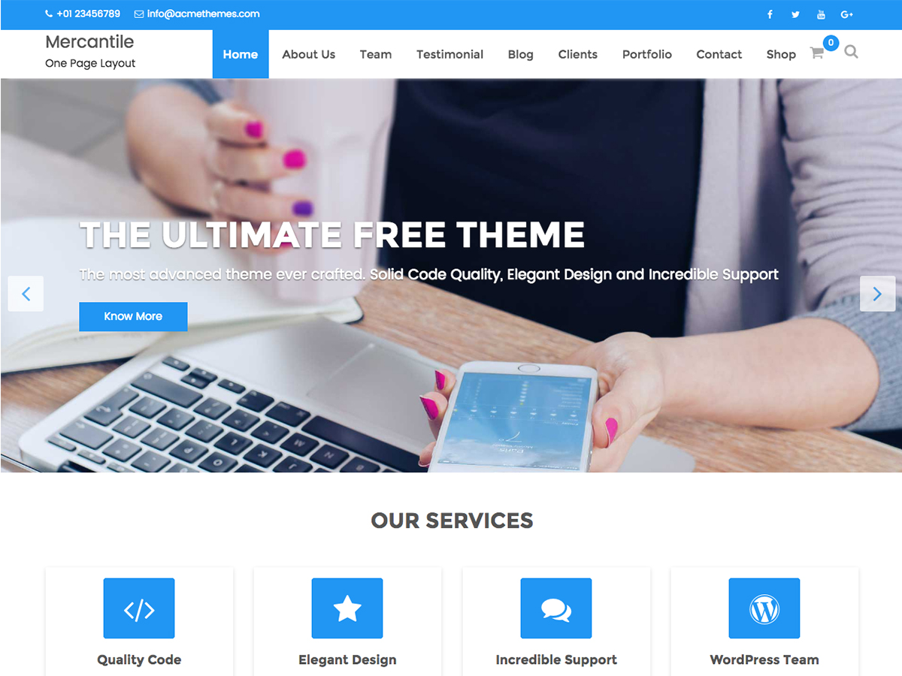

# Mercantile

**Contributors:** acmethemes  
**Requires at least:** 6.6  
**Tested up to:** 7.0  
**Requires PHP:** 7.4  
**Stable tag:** 4.0.0  
**License:** GPLv2 or later  
**License URI:** https://www.gnu.org/licenses/gpl-2.0.html  

> 

Mercantile is a feature-rich multipurpose WordPress theme that can power any kind of website — corporate, business, agency, portfolio, medical, education, travel, restaurant, or blog. With parallax sections, multiple homepage demos, and deep WooCommerce integration, it's one of the most versatile themes in the Acme Themes collection.

## Features

- **Multiple homepage demos** — four pre-built layouts to choose from
- **Parallax featured section** — scrolling depth effect for visual impact
- **Featured slider** — showcase your best content
- **Service & testimonial sections** — build credibility with prospects
- **Portfolio section** — display your work in style
- **Contact section** — built-in contact area with form integration
- **WooCommerce compatible** — full shop functionality
- **Page builder ready** — works with SiteOrigin Page Builder
- **Up to four-column layouts** — flexible grids throughout
- **Custom colors & background** — one-click color change
- **Custom CSS** — advanced styling without a child theme
- **Related posts & breadcrumbs** — better navigation and SEO
- **Post formats** — standard, gallery, image, video
- **Footer widgets** — contact, services, social, and more
- **Sticky sidebar** — keep widgets visible while scrolling
- **Translation ready** — .pot file included
- **RTL support** — right-to-left language compatible

## Installation

1. Download the theme zip file.
2. In your WordPress admin, go to **Appearance → Themes**.
3. Click **Add New** → **Upload Theme**.
4. Select the zip file and click **Install Now**.
5. Click **Activate**.

## Frequently Asked Questions

### Which demo should I start with?

Mercantile offers four demo variations for different use cases. Install the **Acme Demo Setup** plugin to preview and import any of them.

### How do I customize the theme?

Go to **Appearance → Customize** — everything from layout to colors to sections is configurable there.

## Credits

Mercantile is built on [Underscores](https://underscores.me/) and licensed under GPLv2 or later. It bundles the following third-party resources:

- [Google Fonts](https://fonts.google.com/) — Apache License 2.0
- [Font Awesome](https://fontawesome.com/) — MIT / SIL OFL 1.1
- [normalize.css](https://necolas.github.io/normalize.css/) — MIT
- [Bootstrap](http://getbootstrap.com/) — MIT
- [Isotope](https://isotope.metafizzy.co/) — GPLv3
- [Magnific Popup](https://github.com/dimsemenov/Magnific-Popup) — MIT
- [Theia Sticky Sidebar](https://github.com/WeCodePixels/theia-sticky-sidebar) — MIT
- [Breadcrumb Trail](https://github.com/justintadlock/breadcrumb-trail) — GPLv2+
- [TGM Plugin Activation](http://tgmpluginactivation.com/) — GPLv2+
- [html5shiv](https://github.com/afarkas/html5shiv) — MIT
- [Respond.js](https://github.com/scottjehl/Respond) — MIT
- [Waypoints](https://github.com/imakewebthings/waypoints/) — MIT
- [WOW](https://github.com/matthieua/WOW) — MIT
- [Slick](https://github.com/kenwheeler/slick/) — MIT
- [Easy Pie Chart](https://github.com/rendro/easy-pie-chart/) — MIT/GPL

---

[Demo](http://www.demo.acmethemes.com/mercantile/) &middot; [Support](https://www.acmethemes.com/supports/) &middot; [Acme Themes](https://www.acmethemes.com)
